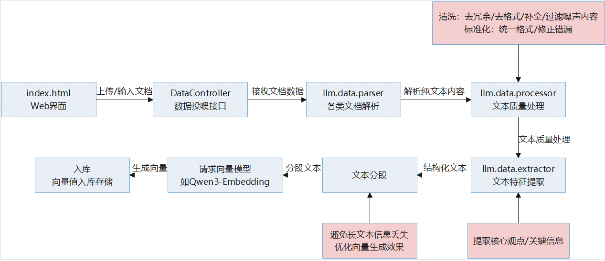
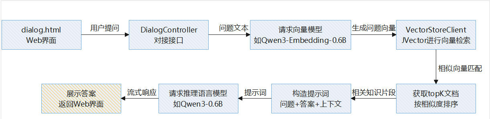

# LingKB-灵知识库项目文档

## 一、项目简介
本项目是一个基于Java 11环境的企业知识库系统，采用Spring Boot框架搭建，使用MySQL存储数据，结合JVector向量检索库和HanLP自然语言处理库构建。
系统外接Qwen3轻量级大语言模型和向量嵌入模型，能够实现知识的高效存储、检索和智能问答功能。
开发初衷是在Java的技术生态下，以`最简洁直接的逻辑链、最低的成本`实现企业知识库的落地；在熟悉或易上手的技术架构下，快速地搭建好用的知识体系。

系统包含两大核心流程：
- 知识入库流程：处理各类文档，提取内容并转换为向量存储

 
- 智能检索流程：基于用户问题，通过向量相似度匹配相关知识

 

## 二、环境准备与部署步骤

### 2.1 自然语言处理库配置（HanLP）
1. 下载数据包：从[HanLP官网](https://file.hankcs.com/hanlp/data-for-1.7.5.zip)获取中文分词和处理所需的数据包
2. 解压到本地目录（如D:/HanLP或/opt/HanLP）
3. 配置路径：打开`hanlp.properties`文件修改`root=你的解压路径`，并将该文件放到`src/main/resources/`下

### 2.2 数据库初始化
1. 执行SQL脚本：在MySQL中运行`src/resources/init.sql`创建必要的表结构
2. 配置连接信息：编辑`application.properties`文件，修改以下配置：
```properties
spring.datasource.url=jdbc:mysql://mysql_host:mysql_port/your_database
spring.datasource.username=your_username
spring.datasource.password=your_password
```
### 2.3 大语言模型服务部署（以 Qwen3 为例）
> **提示**：若选择直接调用在线的外部大语言模型服务，可跳过本章节。
1. 下载模型服务包：从[Hugging Face](https://huggingface.co/Mozilla/Qwen3-0.6B-llamafile/tree/main)获取轻量级语言模型
2. 启动服务（建议在Linux环境下运行）：
```bash
chmod +x Qwen_Qwen3-0.6B-Q8_0.llamafile
```
```bash
./Qwen_Qwen3-0.6B-Q8_0.llamafile --host 0.0.0.0 --port 6666 --server &
```
3. 验证服务：Post访问[/docs接口](http://${serverIP}:6666/v1/chat/completions)进行对话测试，参数如下：
```json
 {
  "messages": [
    {
      "role": "user",
      "content": "1+1=?"
    }
  ]
}
```

### 2.4 向量嵌入模型部署
1. 下载嵌入模型：从[Hugging Face](https://huggingface.co/Mungert/Qwen3-Embedding-0.6B-GGUF/tree/main)获取向量生成模型
2. 安装llama.cpp运行环境（参考模型界面README）
3. 启动服务：
```bash
/llama.cpp/bin/llama-server -m Qwen3-Embedding-0.6B-q4_k_m.gguf --port 6677 --host 0.0.0.0 --embedding --ctx-size 2048 --pooling last &
```

### 2.5 系统配置
编辑`application.properties`文件，配置以下关键参数（eg. 提供了参考值）：
> **提示**：其中可以从[tessdata](https://huggingface.co/spaces/Orkhan/image2text_ocr/tree/main/Tesseract-OCR/tessdata)
下载chi_sim.traineddata、chi_sim_vert.traineddata、eng.traineddata等文件，并放置在${data.parser.tess.path}文件夹下。application.properties文件中的其他参数可保持默认值，或根据实际需求调整
```properties
#### OCR识别引擎路径
data.parser.tess.path=D:/tessdata/

#### 文件上传路径
system.upload.file.dir=D:/knowledge_files/

#### 模型服务地址
qwen.embedding.url=http://localhost:6677/v1/embeddings
qwen.chat.url=http://localhost:6666/v1/chat/completions

#### 向量数据库存储路径(文件初始不存在没关系，当有数据后，程序会自动按命名生成)
vector.data.path=D:/temp/vector/data.hnsw
vector.link.path=D:/temp/vector/link.hnsw
vector.bak.path=D:/temp/vector/data.bak
```


## 三、参与贡献
欢迎参与项目开发或反馈使用问题，联系方式：
邮箱：zhengh@dtdream.com

## 四、鸣谢
感谢您的关注与支持！我们将持续优化系统，提供更强大的企业知识管理能力。
    